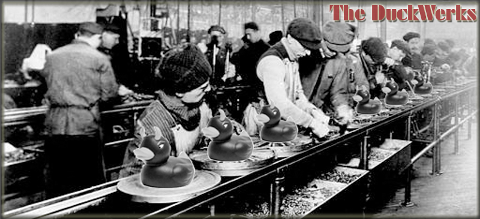

# Duckwerks Dashboard

Personal resale inventory dashboard for **Duckwerks Music** — tracks music gear, comics, and gaming items sold on eBay and Reverb.



---

## Features

- **Inventory tracking** — list price, cost, status (Listed / Sold / In a Lot), site
- **Profit math** — EAF (earnings after fees) calculated per item for Reverb's fee structure
- **Lots** — bundle low-value items into lots, track recovery across the lot
- **Shipping** — Shippo integration: get rates, buy labels, auto-mark orders shipped on Reverb
- **Reverb sync** — match open Reverb orders to inventory, ship directly from the dashboard
- **Quick Find** — live search across items, lots, and categories (`/` or `⌘K`)
- **Dashboard view** — KPIs (invested, revenue, profit, upside), lot recovery table, recently sold

## Stack

| Layer | Tech |
|---|---|
| Frontend | Alpine.js, no build step |
| Backend | Node 22 + Express (local server) |
| Database | Airtable (REST API) |
| Shipping | Shippo API |
| Marketplace | Reverb API |

## Running Locally

```bash
npm install
npm start    # http://localhost:3000
```

Requires a `.env` file with Shippo tokens, Airtable PAT, and a from-address. See `CLAUDE.md` for the full env var list.

## Project Structure

```
server.js               ← Express entry point
server/
  airtable.js           ← Airtable proxy routes
  shippo.js             ← Shippo / label routes
  reverb.js             ← Reverb API proxy
public/v2/
  index.html            ← App shell
  css/                  ← main.css + components.css
  js/
    config.js           ← Airtable field map + constants
    store.js            ← Alpine global store (all data)
    sidebar.js          ← Search + nav
    views/              ← dashboard, items, lots
    modals/             ← item, add, lot, label, reverb
```

## Design

Dark theme · `Space Mono` body · `Bebas Neue` large numbers

Color semantics: **yellow** = estimate/pending · **green** = actual/positive · **red** = cost · **blue** = action