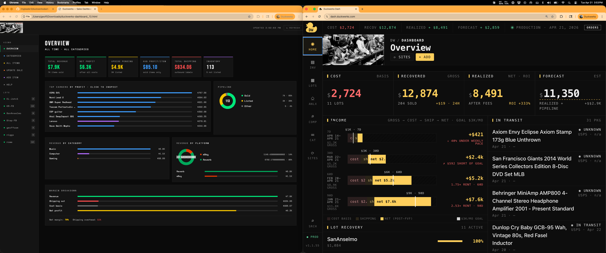

# Duckwerks Dashboard

Personal resale inventory dashboard for **Duckwerks Music** — tracks disc golf, music gear, comics, and gaming items sold on eBay and Reverb.

Designed and built by Geoff Goss with Claude.ai via Claude Code CLI and VS Code extension. This started as a single HTML file in Claude Desktop and evolved into a full-stack local web app over a few weeks of iterative development. I understand every decision made, can maintain it, and use it daily to run the business. It's a demonstration of what 20 years of software development and program management experience, combined with AI-assisted development tools, can produce quickly.


_side by side comapison of v .1 to v2.0_

---

## Features

- **Inventory tracking** — items with cost, status (Listed / Sold / Prepping), category, site, and lot; multi-listing support (e.g. same item on Facebook + Craigslist simultaneously)
- **Profit math** — site-aware fee calculation for Reverb, eBay, and Facebook; EAF (earnings after fees) per item; estimated vs. actual profit throughout
- **Lots** — bundle low-value items into lots, track cost recovery across the lot
- **Shipping** — EasyPost integration: get carrier rates (USPS, UPS, FedEx), buy labels, auto-save tracking, auto-mark orders shipped
- **Label printing** — server-side PDF generation via pdfkit; opens directly in browser print dialog at correct orientation
- **Shipment tracking** — in-transit panel on dashboard and items view; live carrier status, estimated delivery, public tracker link; items auto-clear 3 days after delivery
- **Reverb sync** — match open orders to inventory, ship directly from dashboard; link listings; diff and sync listing name/price changes; import new Reverb listings as inventory records
- **eBay sync** — OAuth 2.0 with auto token refresh; orders awaiting shipment; push tracking to eBay to trigger payout; link listings via Browse API; diff and sync listing name/price changes; import new eBay listings; packing slip + order detail links
- **Momentum chart** — single full-width windowed chart (3d/7d/14d/30d) showing gross + net by site; per-site stacked bars (Reverb/eBay in brand color); hero background bar shows total gross/net as a translucent wash; log y-scale for near-term readability
- **Dashboard KPIs** — Total Invested, Revenue, Profit, Gross Pending (EAF before cost), Upside Pending (after cost+fees), Inventory breakdown
- **Delete item** — removes item and all associated listings, orders, and shipments via cascade
- **Quick Find** — live search across items, lots, and categories (`/` or `⌘K`); keyboard navigation
- **Comp research** — pull sold price comps from eBay (via SerpAPI) and Reverb (Puppeteer headless scrape), then analyze with Claude to produce a narrative + structured CSV; launch from any item modal or the sidebar; results are copyable and downloadable for use in Claude Desktop deal analysis
- **Analytics view** — two-tab analytics panel: Listed tab shows Reverb views/watches + eBay views/impressions/CTR per listing; Sold tab shows Reverb orders pending seller feedback + eBay fulfilled orders within the 60-day feedback window; all columns sortable; site filter toggle buttons per tab; rows click through to item detail
- **Sortable tables** — click any column header to sort ASC/DESC across Items, Lots, and Analytics views
- **Item drill-down** — click status, category, or site badges to jump to a filtered view; lot badge opens Lot detail modal
- **Modal back-navigation** — opening an item from a lot modal returns to the lot on close
- **Catalog intake form** — hidden sidebar view for adding disc golf items directly to the Google Sheet catalog; fields auto-populate disc #, persist box number, and validate against eBay enums
- **eBay bulk listing** — `scripts/bulk-list-discs.js` reads disc catalog from Google Sheet, uploads photos to EasyPost Photo Studio, creates eBay Inventory API listings; supports comma-separated ID ranges (`1-20,25,30-35`); dry run by default, `--confirm` to go live; `--update` mode refreshes title/description/price/condition/aspects on existing listings
- **Flight numbers** — disc flight rating lookup (speed/glide/turn/fade) seeded from a 1,918-disc CSV; auto-populates catalog intake form and eBay listing description + item aspects
- **Multi-item eBay orders** — label modal handles orders with multiple line items; marks all items shipped in one API call; splits payout proportionally across items
- **Sites view** — unified platform sync panel replacing the old per-platform modals; three sections: Orders (pending shipments from eBay + Reverb with direct SHIP flow), Listings (link unmatched platform listings to local records or bulk-import as new items), Details (diff and sync name/price drift); ORDERS ticker button in header shows pending count; view refreshes automatically after shipping
- **Lot actions** — rename, add item (pre-selects lot), delete (guarded — only when empty), export CSV; all from lot modal header
- **Lot KPI restructure** — Cost → Recovered → Realized Profit → Forecasted Profit; whole-dollar rounding throughout; zero cost shows `—` instead of `$0.00` in red
- **Income windows redesign** — dashboard income section shows 7d / 30d / 60d / 90d (YTD dropped); date range label per row; instant custom tooltips on bar segments
- **Analytics sold mode** — Revenue and Profit columns added; sortable; pulls from local order records matched to platform orders
- **HTML partial architecture** — `index.html` is now a 235-line shell; all 7 views and 5 modals live in `public/v2/partials/` as individual HTML files assembled by Express at request time; no client-side async injection

---

## Stack

| Layer | Tech |
|---|---|
| Frontend | Alpine.js, no build step |
| Backend | Node 22 + Express (local server) |
| Database | SQLite via `better-sqlite3` |
| Shipping | EasyPost API |
| Marketplaces | Reverb API, eBay Sell Fulfillment + Inventory API |
| Comp research | SerpAPI (eBay sold listings), Puppeteer (Reverb scrape), Claude API (analysis) |

---

## Running Locally

```bash
npm install
npm start    # http://localhost:3000
```

Requires a `.env` file with EasyPost tokens, eBay OAuth credentials, a from-address, and (for comp research) SerpAPI key, Anthropic API key, and local Chrome path. See `CLAUDE.md` for the full env var list.

---

## Remote Access (NUC + Cloudflare Tunnel)

The app runs persistently on an Intel NUC (Fedora) and is accessible remotely at `dash.duckwerks.com` via Cloudflare Tunnel, protected by Cloudflare Access (email-based one-time code auth).

**On the NUC:**
- App managed by PM2: `pm2 start server.js --name duckwerks` — auto-restarts on reboot
- Tunnel managed by systemd: `sudo systemctl start cloudflared` — auto-restarts on reboot
- Tunnel config: `/home/geoff/.cloudflared/config.yml`

**To check status after a reboot:**
```bash
pm2 status
sudo systemctl status cloudflared
```

**If the server is randomly restarting or 502ing**, check the PM2 systemd service first:
```bash
sudo journalctl -u pm2-geoff.service -n 20
sudo systemctl status pm2-geoff.service
```
Look for "Can't open PID file" or a high restart counter. Root cause: the `PIDFile=` directive in `/etc/systemd/system/pm2-geoff.service` causes systemd to kill PM2 when it can't read the PID file. Fix: remove `PIDFile=`, set `Type=oneshot` + `RemainAfterExit=yes`.

**DNS:** `duckwerks.com` is on Cloudflare. The `dash` subdomain CNAME points to the tunnel.

---

## Project Structure

```
server.js               ← Express entry point
server/
  db.js                 ← SQLite connection (better-sqlite3)
  catalog.js            ← Sites + categories
  items.js              ← Inventory CRUD
  listings.js           ← Platform listing records
  orders.js             ← Order records
  shipments.js          ← Shipment records
  label.js              ← EasyPost: rates, purchase, tracking, PDF print
  reverb.js             ← Reverb API proxy
  ebay.js               ← eBay Sell Fulfillment routes + OAuth flow
  ebay-auth.js          ← eBay token management + auto-refresh
  comps.js              ← Comp research: SerpAPI eBay search + Puppeteer Reverb scrape + Claude analysis
  ebay-listings.js      ← eBay Inventory API bulk listing + update
  catalog-intake.js     ← Catalog intake form — Google Sheets append via service account
  shippo.js             ← Shippo proxy (retained, inactive)
public/v2/
  index.html            ← App shell (~235 lines); partials assembled by Express
  css/
    main.css            ← Design tokens, layout
    components.css      ← Badges, cards, modals, tables
  js/
    config.js           ← Constants, fee tables
    store.js            ← Alpine global store (all data + helpers)
    sidebar.js          ← Search + nav
    charts.js           ← Chart.js analytics section
    views/
      dashboard.js
      items.js
      lots.js
      analytics.js
      comps.js          ← Comp research UI
      sites.js          ← Platform sync (orders, listings, details)
    modals/
      item-modal.js
      add-modal.js
      lot-modal.js
      label-modal.js    ← Full shipping flow
      shipping-modal.js ← In-transit tracking panel
  partials/
    views/              ← HTML for each view (dashboard, items, lots, analytics, comps, catalog, sites)
    modals/             ← HTML for each modal (item, add, lot, label, shipping)
```

---

## Build Timeline

| Date | Milestone |
|---|---|
| Mar 4 | First draft in Claude Desktop — single HTML file, proof of concept |
| Mar 12 | First git commit (`v19`) — Airtable, Shippo labels, and Reverb API already working |
| Mar 15 | v2 rebuild begins — full architectural reset in one day: modular Express server, Alpine store, design system, sidebar search, Items view, Item/Add modals |
| Mar 16 | Sprint day — Lots view, Dashboard KPIs, Label modal (full Shippo flow), Reverb Sync modal, v2 cutover, keyboard nav, GitHub Issues |
| Mar 17 | Refinement — sortable columns, readability pass, analytics charts (Chart.js), Recently Listed panel, item drill-down navigation, Reverb listing detail sync |
| Mar 18 | Migrated shipping to EasyPost — 3000 labels/month, proper sandbox; added full shipment tracking across dashboard, items view, and item modal |
| Mar 19–20 | Lot modal polish, site-aware fee math (Reverb/eBay/Facebook), first real order end-to-end |
| Mar 22 | UPS rates fix (EasyPost label size enum); server-side PDF label printing via pdfkit |
| Mar 24 | eBay integration — OAuth 2.0, orders awaiting shipment, push tracking, link listings |
| Mar 25 | Migrated database from Airtable to SQLite (`better-sqlite3`); full validation and cutover |
| Mar 26 | eBay Browse API — listing sync, name/price diffs, "New on eBay" import; "New on Reverb" import |
| Mar 26 | First real eBay order end-to-end — address fix, tracking push, packing slip links, payout capture |
| Mar 26 | KPI fixes — Gross Pending card, corrected Upside Pending and lot profit calculations; delete item |
| Mar 26 | Semantic versioning (v0.9.0); eBay modal section reorder; batch sync flicker fix |
| Mar 26 | Momentum chart (v0.9.1) — single full-width windowed chart replaces 4-chart analytics grid |
| Mar 27 | UI polish batch — modal normalization, nav dots, sortable lot columns, sidebar search improvements |
| Mar 27 | Analytics view (v1.0.0) — Listed tab (Reverb + eBay traffic data); Sold tab (pending feedback orders); sortable columns; item click-through |
| Mar 28–29 | Comp research view (v1.0.8) — SerpAPI eBay sold listings + Puppeteer Reverb scrape + Claude analysis; structured CSV + narrative output; launch from item modal or sidebar; copy/download results |
| Mar 30 | Multi-listing per item (v1.0.9) — FB/CL support: checkbox site selection in Add Item, listings mini-table in item modal, per-row Mark Sold flow, contains-style site filter |
| Apr 1–9 | eBay bulk listing system — `bulk-list-discs.js` + Inventory API integration; catalog intake form; comp research Reverb v2 research; label print alignment fixes; shipping estimate tuning; eBay aspect/condition fixes; comma-separated `--ids` support; `--confirm` pattern standardized across all scripts; project cleanup (removed v1 monolith, Airtable scripts, stale reference files) |
| Apr 9–19 | Design system refresh (v1.1.x) — slim hero bands on all views, sortable columns with localStorage persistence, filter-aware KPI tape, filter chip labels, row-click affordance, toast notifications, inventory export CSV, comps auto-hide uniform columns, catalog view parity |
| Apr 19 | Multi-item eBay order support (v1.1.49) — label modal handles multiple line items, proportional payout split, single tracking push marks all items shipped |
| Apr 20 | Inventory workbench (v1.1.50) — mode-switching tables (Listed/Sold/All), multi-select site filter pills, date range filter, expanded search (name + SKU + lot + notes), forecast stat in tape |
| Apr 20 | Flight numbers (v1.1.48) — 1,918-disc lookup table, auto-populates catalog intake + eBay listing aspects and description |
| Apr 21 | Sites view (v1.1.51–52) — unified sync panel replaces per-platform modals; Orders / Listings / Details sections; ORDERS ticker; post-ship auto-refresh |
| Apr 21 | index.html partial architecture (v1.1.54) — 2,235-line monolith split into 12 partials assembled by Express; shell is 235 lines |
| Apr 21 | Lots improvements (v1.1.55) — rename/add item/delete/export CSV actions; KPI restructure; whole-dollar rounding (fmt0 fix); normalized empty states |
| Apr 21 | Income windows + analytics (v1.1.56) — 7/30/60/90d windows, date range labels, instant custom tooltips; analytics sold mode gets Revenue + Profit columns |
| Apr 21 | v2.0.0 — design system refresh complete; 8 tickets closed |

~3.5 weeks from first idea to v1.0.0 — production tool with dual-marketplace integration, shipping automation, and analytics. The v2 rebuild — clean architecture, full modal/shipping/sync workflow — took 2 days. v2.0.0 marks completion of a full design system refresh: consistent visual language, modular HTML architecture, and unified platform sync across the app.

---

## Design

Dark theme · `Space Mono` body · `Bebas Neue` large numbers

Color semantics: **yellow** = estimate/pending · **green** = actual/positive · **red** = cost · **blue** = action

